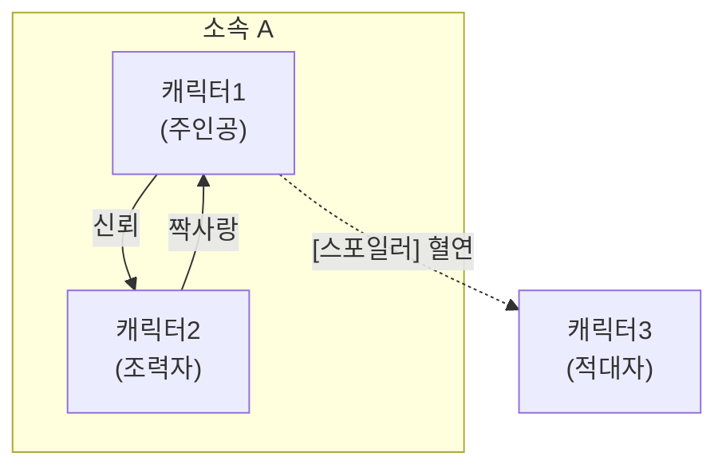

# 캐릭터 설계 가이드

## 역할별 설계 포인트

| 역할 | 핵심 | 흔한 실수 |
|------|------|----------|
| **주인공** | 관객 동일시 + 결핍 + 변화 | 만능, 수동적 |
| **적대자** | 자체 논리와 동기, 주인공의 거울 | 단순 악역 |
| **조력자** | 주인공 약점 보완, 독자적 서브플롯 | 기능만 있고 성격 없음 |
| **멘토** | 지혜 전달, 퇴장이 주인공 성장 촉진 | 만능 해결사 |
| **트릭스터** | 긴장 완화, 예측불가, 진실 말하기 | 단순 코미디 릴리프 |

---

## 내면 설계

### Want vs Need

- **Want (욕망)**: 캐릭터가 의식적으로 추구하는 목표 — 외적, 구체적
- **Need (결핍)**: 캐릭터가 인지하지 못하는 진짜 필요 — 내적, 추상적
- **내적 갈등**: Want ↔ Need의 충돌이 캐릭터를 입체적으로 만든다

예시:
> Want: 왕국 최강의 기사가 되고 싶다
> Need: 타인을 신뢰하는 법을 배워야 한다
> 갈등: 혼자 강해지려 할수록 동료를 밀어낸다

### 성장 아크

| 유형 | 설명 | 적합한 장르 |
|------|------|------------|
| **Positive** | 결핍 인식 → 변화 → 성장 | 성장물, 모험 |
| **Negative** | 결핍 인식 실패 → 타락/몰락 | 비극, 범죄 |
| **Flat** | 이미 완성된 캐릭터가 주변을 변화시킴 | 히어로물, 탐정물 |

---

## 관계 설계

### 관계 유형

동맹, 적대, 멘토-멘티, 라이벌, 로맨스, 혈연, 주종, 채무 등.
한 관계에 복수 유형이 겹치면 긴장감이 높아진다 (예: 라이벌 + 로맨스).

### 관계도 출력 (Mermaid)



관계도 작성 시:
- 주인공 중심으로 배치
- 소속/진영별 subgraph 그룹화
- 스포일러 관계는 점선(`-.->`) + `[스포일러]` 표시

---

## 대사 설계

### 말투 차별화 체크리스트

- 존칭/반말 기본 설정
- 어휘 수준 (학술적 / 구어 / 은어 / 고어체)
- 말버릇, 감탄사, 입버릇
- 문장 길이 패턴 (짧고 끊기 vs 장문)
- 감정 표현 방식 (직접적 vs 억제)

### 대사 샘플 작성법

상황 태그 + 대사 + 맥락을 조합한다:

```markdown
## 대사 샘플

> "검을 뽑는 건 각오가 섰을 때뿐이다. 아직인가?"
> — 동료에게, 훈련 중

> "...미안하다는 말은 하지 않겠다. 그 자격이 없으니까."
> — [스포일러] ████에게

> "하, 그 요리를 '먹을 수 있는 것'이라고 부르다니. 용감하군."
> — 일상, 식사 중
```

각 대사가 보여줘야 할 것:
- 캐릭터의 말투와 어휘 수준
- 상대/상황에 따른 톤 변화
- 성격 핵심 (유머, 냉철, 따뜻함 등)
- 스포일러 대사는 정체를 숨기되 존재를 암시

---

## 출력 형식: 나무위키식 캐릭터 프로필

다음 템플릿으로 캐릭터 프로필을 출력한다. 항목이 없는 섹션은 생략 가능.

```markdown
# [캐릭터명]

> "[캐릭터를 대표하는 대사 한 줄]"

## 프로필

| 항목 | 내용 |
|------|------|
| 이름 | |
| 나이 | |
| 성별 | |
| 종족 | |
| 소속 | (스포일러 시 → [스포일러]) |
| 직업/역할 | |
| 칭호/별명 | |
| 외형 특징 | |

## 성격 및 특징

(성격 묘사, 습관, 특이사항. 문단 형태로 서술)

## 인물 관계

| 대상 | 관계 | 설명 |
|------|------|------|
| [이름] | [관계 유형] | [한 줄 설명] |

## 대사 샘플

> "대사"
> — 상황

> "대사"
> — 상황

## 작중 행적

### [시기/챕터명]
(행적 서술)

### [스포일러] [시기/챕터명]

> ⚠️ 이하 내용은 스토리의 핵심 반전을 포함합니다.

(스포일러 행적)

## 여담
- (트리비아, 모델, 비하인드 등)
```

### 스포일러 처리 규칙

1. **프로필 표**: 스포일러 항목 값을 `[스포일러]`로 대체
2. **관계 표**: 스포일러 관계의 설명에 `[스포일러]` 접두사
3. **대사 샘플**: 상대 이름을 `████`로 마스킹, 상황에 `[스포일러]` 표시
4. **행적**: 스포일러 챕터 제목에 `[스포일러]` 접두사 + 경고 블록
5. **여담**: 스포일러 여담은 별도로 `[스포일러]` 표시